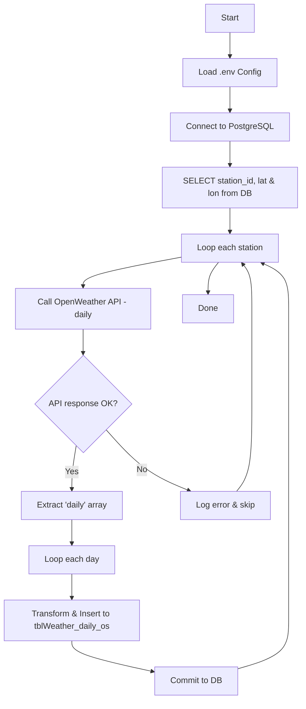

# 🌦️ OpenWeather Daily ETL

ETL script for extracting daily weather forecast data from the OpenWeather API and loading it into a PostgreSQL database.

This project is designed for simplicity, testing, and future extensibility (e.g. hourly forecast, dashboard, or alert system).

---

## 📁 Project Structure

```
weather_daily_os/
├── .env # API keys and DB credentials (not included in repo)
├── .gitignore # Ignore .env, pycache, etc.
├── main.py # Main script to run the ETL process
├── database_manager.py # Database connection manager
├── openweather_daily.py # Core logic: fetch → transform → load
└── requirements.txt # Python dependencies
```

## Flow diagram
```
[Start]
   ↓
[Load .env Config]
   ↓
[Connect to PostgreSQL]
   ↓
[SELECT station_id, lat, lon FROM tblWeather_station_tmd]
   ↓
[Loop: each station]
   ↓
[Call OpenWeather API (daily forecast)]
   ↓
[Check response + Extract daily[]]
   ↓
[Loop: each day in daily[]]
   ↓
[Transform → INSERT INTO tblWeather_daily_os]
   ↓
[Commit + Continue]
   ↓
[Done]

```
---

## Flowchart


